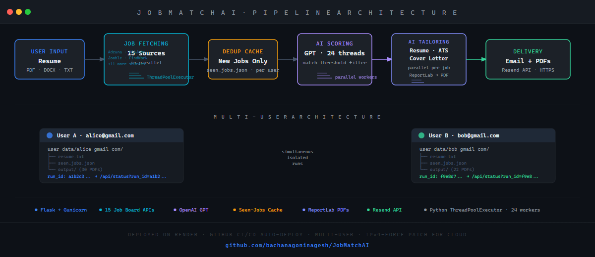

# JobMatchAI for Everyone

> 🤖 An AI-powered job search automation platform that fetches listings from 15 job boards, scores each one against your resume using GPT, tailors your resume and cover letter per match, and emails ready-to-apply PDFs — all in one click.

---

## 🎥 Demo Video

> 📽️ **[▶ Watch Demo Video](https://www.youtube.com/watch?v=YOUR_VIDEO_ID)** — replace this link with your actual recording

---

## 📋 Project Overview

This project focuses on building an end-to-end AI Job Search Automation Platform using Python, Flask, and the OpenAI GPT API to eliminate the manual effort of daily job searching. The system helps job seekers discover relevant opportunities, receive ATS-optimized resumes, and get personalized cover letters — automatically delivered to their inbox every day.

The platform supports multiple users simultaneously, each with their own isolated resume, configuration, and seen-jobs cache — ensuring no two users ever interfere with each other's data or pipeline runs.

---

## 🏗️ System Architecture



The pipeline runs end-to-end as a background process spawned per user:

```
User uploads resume
        ↓
Flask backend extracts text (pypdf / python-docx)
        ↓
15 job board APIs fetched IN PARALLEL (ThreadPoolExecutor)
        ↓
Seen-jobs cache filters already-processed listings
        ↓
24 parallel GPT workers score each job vs. resume
        ↓
Qualified jobs → resume tailoring + cover letter (parallel per job)
        ↓
ReportLab generates PDFs (tailored resume + cover letter per job)
        ↓
Resend API delivers all PDFs to user's inbox
```

---

## 🎯 Business Impact

| KPI | Result |
|---|---|
| 🕐 Time spent job searching | ↓ ~95% (fully automated daily) |
| 📄 Resume customization per application | ↑ 100% (AI-tailored per job) |
| 🔍 Job sources covered | 15 APIs aggregated simultaneously |
| ⚡ Scoring throughput | 24 jobs scored in parallel via GPT |
| 📬 Duplicate applications avoided | ↓ 100% (per-user seen-jobs cache) |

- Eliminated manual resume editing per application through GPT-powered ATS keyword injection
- Reduced job discovery time from hours to seconds by parallelising 15 API calls simultaneously
- Per-user seen-jobs deduplication ensures zero wasted API calls or duplicate email results on daily runs
- Multi-user isolation allows the platform to serve multiple job seekers simultaneously without data leakage

---

## 🎥 Demo Video

<a href="https://drive.google.com/file/d/1X9tNMC9U9-_fFXIv_UNrXcIvd8sPrY8s/view?usp=sharing" target="_blank">
  
</a>

> 
---
## 🚀 Key Features

- **15 job board integrations** — Adzuna, USAJobs, Jooble, FindWork, Remotive, Indeed RSS, Lever ATS, Greenhouse ATS, The Muse, RemoteOK, Jobicy, Arbeitnow, WeWorkRemotely, WorkingNomads, Hacker News Hiring
- **AI-powered job scoring** — GPT evaluates fit between each job description and the user's resume, filtering by a configurable match threshold
- **ATS resume tailoring** — GPT rewrites the resume with role-specific keywords to pass Applicant Tracking Systems
- **Custom cover letter generation** — GPT drafts a unique cover letter for every qualified job
- **PDF generation** — tailored resume + cover letter packaged as PDFs via ReportLab
- **Email delivery** — all PDFs emailed as attachments via Resend API (HTTPS-based, works on cloud)
- **Multi-user support** — fully isolated per-user directories for resumes, configs, output PDFs, and caches
- **Deduplication cache** — per-user `seen_jobs.json` prevents reprocessing jobs on daily runs
- **Resume parsing** — multi-method extraction for PDF, DOCX, DOC, and TXT with fallback chains
- **Password-protected access** — site-wide password gate via Flask sessions

---

## 📊 Pipeline Stages

### 🔍 Job Fetching
All 15 job board APIs are called simultaneously using `ThreadPoolExecutor`. Each source runs its own parallel sub-requests per target role — cutting total fetch time from minutes to seconds.

### 🧠 AI Scoring
Every fetched job is scored against the uploaded resume by GPT in a pool of 24 parallel workers. Jobs below the user's match threshold are dropped before any PDF generation begins.

### ✍️ Resume Tailoring + Cover Letter
For each qualified job, resume tailoring (ATS keyword injection) and cover letter writing run in parallel — two GPT calls fired simultaneously per job, then PDFs generated sequentially.

### 📧 Email Delivery
All PDFs (2 per job — resume + cover letter) are batched and sent as attachments via the Resend API. Gmail SMTP is available as a local development fallback.

### 🔄 Deduplication
On every daily run, a per-user `seen_jobs.json` cache filters out jobs already processed. Only genuinely new postings are scored and emailed — no duplicates across runs.

---

## 🛠️ Tech Stack

| Layer | Tools |
|---|---|
| Backend | Python 3, Flask, Gunicorn |
| AI / LLM | OpenAI GPT API |
| Concurrency | Python threading, ThreadPoolExecutor |
| Document Parsing | pypdf, python-docx |
| PDF Generation | ReportLab |
| Email Delivery | Resend API, smtplib (fallback) |
| Frontend | HTML, CSS, Vanilla JavaScript |
| Deployment | Render (cloud), GitHub (CI/CD) |
| Data Sources | 15 REST/RSS job board APIs |

---

## 🗄️ Technical Highlights

### AI & LLM Integration
- Used OpenAI GPT API for three distinct tasks: semantic job-resume scoring, ATS keyword injection into resume JSON, and cover letter generation — each with carefully engineered prompts
- Resume parsed once into structured JSON and reused across all job tailoring calls — eliminating redundant API calls and cutting token usage by N-1 per run
- Safety nets restore all resume sections (experience, skills, education) if GPT returns incomplete output

### Concurrent Programming
- 15 job board API calls executed simultaneously via `ThreadPoolExecutor`
- 24 parallel GPT scoring workers process the full job list concurrently
- Per-job tailoring: resume tailoring and cover letter generation fired as two parallel threads, then joined before PDF generation
- Per-user pipeline locks prevent one account from running two pipelines simultaneously

### Multi-User Architecture
- Each user identified by email — data stored in `user_data/{safe_email}/`
- Every run assigned a UUID (`run_id`) returned to the client; status polled at `/api/status?run_id=xxx`
- Per-session PDF extract cache prevents cross-user resume contamination during parallel uploads
- In-memory run registry pruned automatically after 30 minutes to prevent memory growth

### Cloud Deployment
- Deployed on Render free tier with Gunicorn (single worker, 4 threads — required for shared in-memory state)
- IPv4-force socket patch applied at startup to work around Render's missing IPv6 routing (errno 101)
- Resend API used for email (HTTPS port 443) because Render blocks all outbound SMTP ports (25/465/587)
- All secrets managed via environment variables — never committed to source

### Resume Parsing Pipeline
- PDF extraction: pypdf with `strict=False` tolerates malformed xref tables → pdfplumber fallback
- DOCX extraction: 4-pass strategy (paragraphs → table cells → floating text boxes → headers/footers)
- Per-session extract cache: if browser sends truncated text (<1,500 chars), server auto-recovers from cached extraction

---

## 🗂️ Repository Structure

```
jobmatchai-for-everyone/
│
├── app.py                  # Flask server — auth, routing, multi-user pipeline management
├── main.py                 # Pipeline entry point — fetch → deduplicate → score → tailor → email
├── job_fetcher.py          # 15 job board API integrations, parallel fetching
├── matcher.py              # GPT scoring, resume tailoring, cover letter generation
├── pdf_generator.py        # ReportLab PDF creation (resume + cover letter)
├── email_sender.py         # Resend API + Gmail SMTP email delivery
│
├── templates/
│   └── index.html          # Single-page frontend with live pipeline log
│
├── requirements.txt        # Python dependencies
├── render.yaml             # Render cloud deployment config
├── .env.example            # Environment variable template
├── .gitignore
└── README.md
```

---

## ⚙️ Environment Variables

| Variable | Description | Source |
|---|---|---|
| `OPENAI_API_KEY` | OpenAI API key | [platform.openai.com](https://platform.openai.com/api-keys) |
| `ADZUNA_APP_ID` | Adzuna app ID | [developer.adzuna.com](https://developer.adzuna.com) |
| `ADZUNA_APP_KEY` | Adzuna API key | Same as above |
| `USAJOBS_API_KEY` | USAJobs API key | [developer.usajobs.gov](https://developer.usajobs.gov) |
| `USAJOBS_EMAIL` | Email registered with USAJobs | Same as above |
| `JOOBLE_API_KEY` | Jooble API key | [jooble.org/api/about](https://jooble.org/api/about) |
| `FINDWORK_API_KEY` | FindWork API token | [findwork.dev](https://findwork.dev) → Profile |
| `RESEND_API_KEY` | Resend email API key (required on cloud) | [resend.com](https://resend.com) |
| `EMAIL` | Gmail address (local SMTP fallback) | Your Gmail |
| `EMAIL_PASSWORD` | Gmail App Password | Google Account → Security → App Passwords |
| `SITE_PASSWORD` | Site access password | Choose any |

---

## 🚀 Local Setup

```bash
# 1. Clone
git clone https://github.com/bachanagoninagesh/JobMatchAI.git
cd JobMatchAI

# 2. Virtual environment
python -m venv venv
venv\Scripts\activate        # Windows
# source venv/bin/activate   # macOS / Linux

# 3. Install dependencies
pip install -r requirements.txt

# 4. Configure environment
cp .env.example .env
# Fill in your API keys in .env

# 5. Run
python app.py
# Open http://localhost:5000
```

---

## 📬 Contact

**Nagesh Bachanagoni** — Data Engineer / Full-Stack Developer  
📧 nageshbachanagoni@gmail.com  
🔗 [LinkedIn](https://linkedin.com/in/nageshbachanagoni) · [Portfolio](https://github.com/bachanagoninagesh)

---

*Built with Python · Flask · OpenAI GPT API · ReportLab · Resend · Render*
